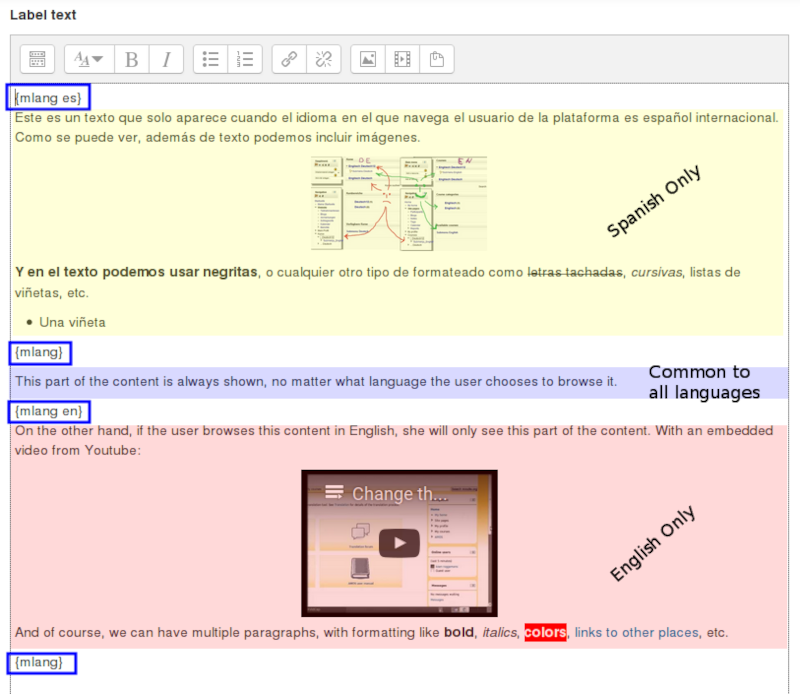
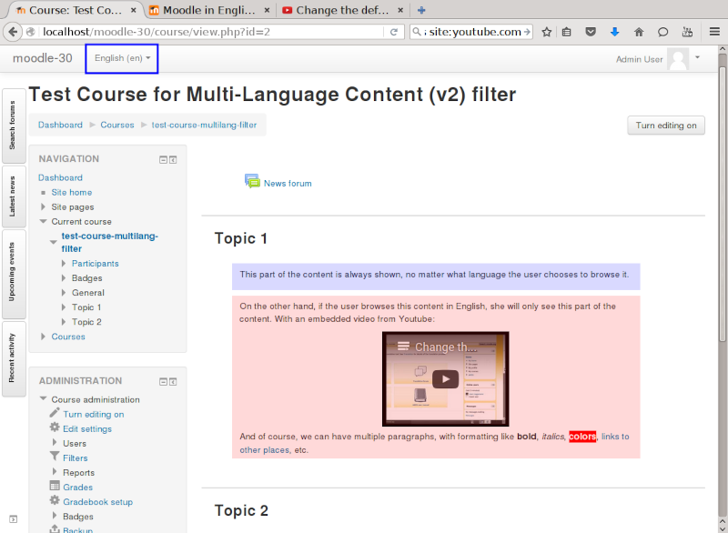
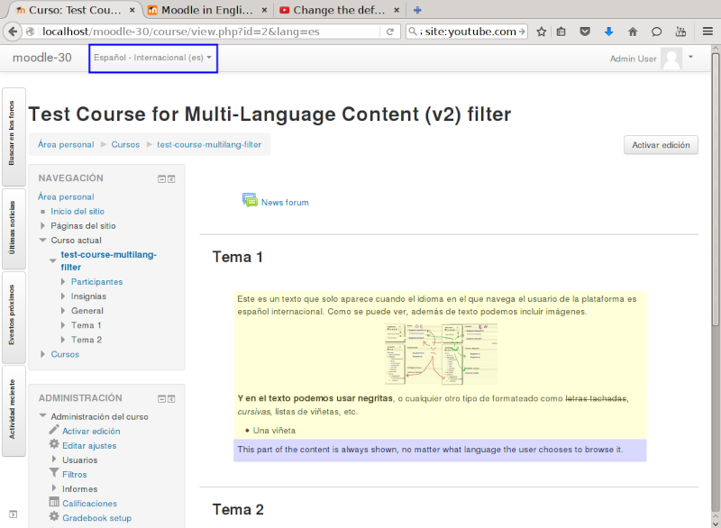

moodle-filter_multilang2
========================

# To Install it manually #
- Unzip the plugin in the moodle .../filter/ directory.

# To Enable it #
- Go to "Site Administration &gt;&gt; Plugins &gt;&gt; Filters &gt;&gt; Manage filters" and enable the plugin there.

# To Use it #
- Create your contents in multiple languages.
- Enclose every language content between `{mlang XX}` and `{mlang}` tags (also known as a "language blocks"):
  <pre>
    {mlang XX}content in language XX{mlang}
    {mlang YY}content in language YY{mlang}
    {mlang other}content for other languages{mlang}</pre>
- where **XX** and **YY** are the Moodle short names for the language packs (i.e., `en`, `en_CA`, `en_kids`, `fr_ca`, `de`, etc.) or the special language name `other`.
- **Version 1.1.1** and later: a new enhanced syntax to be able to specify multiple languages for a single tag is now available. Just specify the list of the languages separated by commas. E.g.,:
  <pre>
  {mlang en,es,fr_ca}Text displayed if the user's active language is en, es or fr_ca, or one of their parent languages.{mlang}</pre>
- Test it (by changing your browsing language in Moodle

# How it works #
In the descriptions below, "the user's active language" refers to the language that the user has configured as the active browsing language at a given moment. It can be the language that the user has configured in his or her profile, or the language that the user has temporarily set by choosing a different browsing language from Moodle's language menu.

## Default behaviour ##
- Look for language blocks in the text to be filtered.
- For each language block:
  - If there are texts in the user's active language, print them.
  - Else, if there exist texts in any parent language(s) of the user's active language, unless the parent language is 'en', print them. This behaviour is configurable in version 2.0.5 and later (see "Configurable parent languages behaviour" below).
  - Else, as fallback, print the text with language `other` if such one is set.
  - Else, don't print any text inside the language block.
- Text outside of language blocks will always be printed.

## Configurable parent languages behaviour ##
Since version 2.0.5, the plugin offers a setting to configure how the filter will behave  when processing a language block, with respect to parent languages.

As stated above, the filter determines whether a text in a language block should be displayed or not based on the language(s) specified in the block, and the user's active language. This matching process can follow three different approaches, known as "_parent languages behaviour_". The sections below describe each of the available parent language behaviours.

### Always use parent languages, excluding 'en'.
This is the default setting. The filter takes the user's active language (e.g., `en_us_kids12`) and computes its parent languages list. When computing the parent languages list, `en` is never included in that list. E.g, for `en_us_kids`, the parent languages list would only include `en_us` (even if `en` is the parent langauge of `en_us`, as `en` is always excluded from the parent languages list in this case). But for `fr_ca_kids12`, the parent languages list would include `fr_ca` and `fr`.

The filter then checks if any of the languages specified in the language block matches either the user's active language, or any of the languages in the parent languages list. If any match if found, the language block is printed. If no match is found, the language block is not printed.

**Example 1**: If the user's active language is `en_us_kids12`, the parent languages will include `en_us` only (as `en` will always be excluded in this behaviour). Thus, a language block like `{mlang en_us_kids12}Some content in en_us_kids12{mlang}` will be printed. And so will a language block like `{mlang en_us}Some content in eu_us{mlang}`. But a language block like `{mlang en}Some content in en{mlang}` will not be printed. Because `en` is excluded from the list of parent languages and thus will not match the language block's language.

**Example 2**: If the user's active language is `fr_ca_kids12`, the parent languages will include `fr_ca` and `fr`. Thus, a language block like `{mlang fr_ca_kids12}Some content in fr_ca_kids12{mlang}` will be printed. And so will a language block like `{mlang fr_ca}Some content in fr_ca{mlang}` and a language block like `{mlang fr}Some content in fr{mlang}`.

**Note**: English can still be used explicitly in the language block. But the text of that language block will only be printed when the user's active language is exactly `en`.

### Always use parent languages, including 'en'.

This setting works like the previous one, but it doesn't exclude the `en` language from the list of valid parent languages of the user's active language.

**Example 1**: If the user's active language is `en_us_kids12`, the parent languages will include `en_us` and `en` (as with this setting, `en` is not excluded from the list of valid parent languages). Thus, a language block like `{mlang en_us_kids12}Some content in en_us_kids12{mlang}` will be printed. And so will language blocks like `{mlang en_us}Some content in en_us{mlang}` or `{mlang en}Some content in en{mlang}`.

**Example 2**: If the user's active language is `fr_ca_kids12`, the parent languages will include `fr_ca` and `fr`. Thus, a language block like `{mlang fr_ca_kids12}Some content in fr_ca_kids12{mlang}` will be printed. And so they will language blocks like `{mlang fr_ca}Some content in fr_ca{mlang}` or  `{mlang fr}Some content in fr{mlang}`. But a language block like `{mlang en}Some content in fr{mlang}` will **not** be printed. Because in this case, the `en` language is not a parent language of `fr_ca_kids12` (only `fr` and `fr_ca` are).

### Never use parent languages.
As the name suggests, no parent languages are ever used. The filter only matches the languages explicitly listed in the language block to the user's current language, without considering any parent languages.

**Example**: If the user's active language is `fr_ca_kids12`, a language block like `{mlang fr_ca_kids12}Some content in fr_ca_kids12{mlang}` will be printed. But language blocks like `{mlang fr_ca}Some content in fr_ca{mlang}` or `{mlang fr}Some content in fr{mlang}` will not be printed.

## Definition of a language block ##
It is any text (including spaces, tabs, linefeeds or return characters) placed between '{mlang XX}' and '{mlang}' markers. You can not only put text inside a language block, but also images, videos or external embedded content. For example, this is a valid language block:

<pre>
{mlang es,es_mx,es_co}
First paragraph of text. First paragraph of text. First paragraph of text.

Second paragraph of text. Second paragraph of text. Second paragraph of text.

                   An image could go here

Third paragraph of text. Third paragraph of text. Third paragraph of text.

                   An embedded Youtube video could go here

Fourth paragraph of text. Fourth paragraph of text. Fourth paragraph of text.
{mlang}
</pre>

## A couple of examples in action ##

### Using text only

This text:
  <pre>
  {mlang other}Hello!{mlang}{mlang es,es_mx}¡Hola!{mlang}
  This text is common for all languages because it's outside of all language blocks.
  {mlang other}Bye!{mlang}{mlang it}Ciao!{mlang}</pre>
- If the current language is any language except "Spanish International", "Spanish - Mexico" or Italian, it will print:
  <pre>
  Hello!
  This text is common for all languages because it's outside of all language blocks.
  Bye!</pre>
- If the current language is "Spanish International" or "Spanish - Mexico", it will print:
  <pre>
  ¡Hola!
  This text is common for all languages because it's outside of all language blocks.</pre>
- Notice the final 'Bye!' / 'Ciao!' is not printed.
- If the current language is Italian, it will print:
  <pre>
  This text is common for all languages because it's outside of all language blocks.
  Ciao!</pre>
- Notice the leading 'Hello!' / '¡Hola!' and the final 'Bye!' are not printed.

### Using text, images and external embedded content

We create a label with the content shown in the following image:

The language block tags are highlighted using blue boxes. You can see that we have three pieces of content: the Spanish-only content (light yellow box), the language-independent content (light blue) and the English-only content (light red).

If the user browses the page with English as her active language, she will see the language-independent content (light blue box) and the English-only content (light red):

If the user browses the page with Spanish as her active language, she will see the Spanish-only content (light yellow) plus the language-independent content (light blue box):

